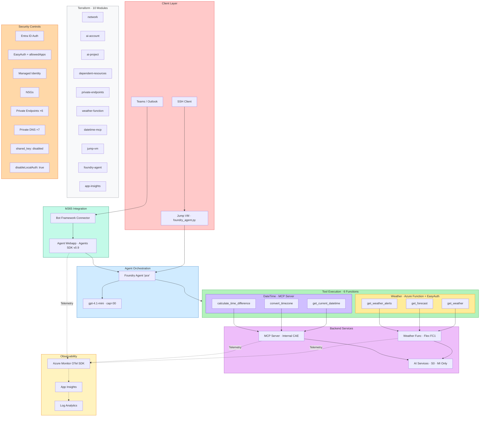
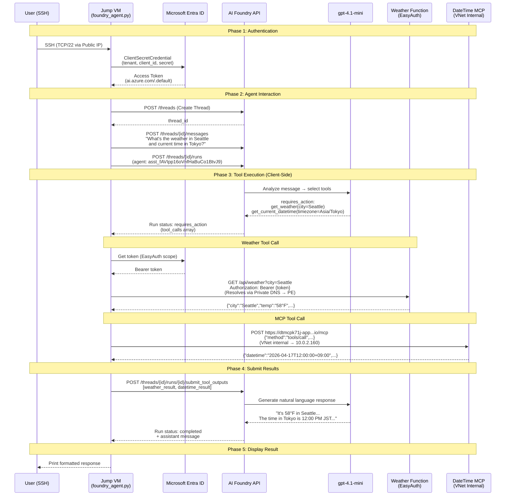
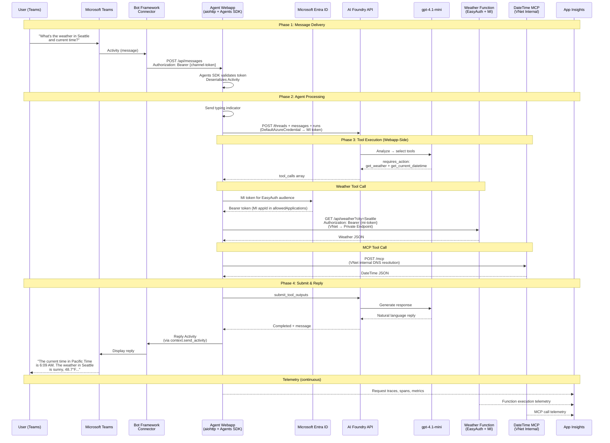
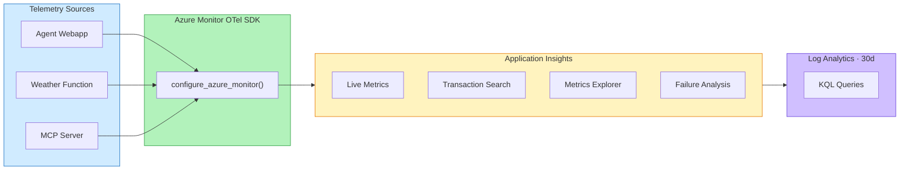

# Hybrid VNet AI Agent — Architecture Diagrams

## 1. High-Level Architecture

```mermaid
graph TB
    subgraph Internet["Internet / Public"]
        User["User · SSH Client"]
        M365["M365 · Teams / Outlook"]
        EntraID["Entra ID · Token Issuance"]
        FoundryAPI["AI Foundry Agent API"]
        WeatherFQDN["Weather Function FQDN"]
        BotConnector["Bot Framework Connector"]
    end

    subgraph VNet["agent-vnet · 10.0.0.0/16"]
        subgraph AgentSubnet["agent-subnet · 10.0.0.0/24"]
            DataProxy["AI Services Data Proxy"]
        end

        subgraph PESubnet["pe-subnet · 10.0.1.0/24"]
            PE_AI["PE: AI Services"]
            PE_Blob["PE: Blob"]
            PE_Cosmos["PE: Cosmos DB"]
            PE_Func["PE: Weather Func"]
            PE_Queue["PE: Queue"]
            PE_File["PE: File"]
        end

        subgraph MCPSubnet["mcp-subnet · 10.0.2.0/24"]
            CAE["CAE Internal · 10.0.2.160"]
            MCPServer["DateTime MCP Server"]
        end

        subgraph FuncSubnet["func-integration · 10.0.3.0/24"]
            FuncVNet["Weather Func VNet Out"]
        end

        subgraph JumpSubnet["jumpbox-subnet · 10.0.4.0/24"]
            JumpVM["jumpbox-vm · Ubuntu 24.04"]
        end

        subgraph AgentAppSubnet["agent-app-subnet · 10.0.6.0/23"]
            AgentCAE["CAE External · internet-facing"]
            AgentWebapp["Agent Webapp · Agents SDK"]
        end
    end

    subgraph Services["Azure PaaS Services"]
        AISvc["AI Services · S0 · gpt-4.1-mini"]
        WeatherFunc["Weather Function · Flex FC1"]
        ACR["ACR: acrdtmcpk71j"]
        Storage1["Storage: AI data blob"]
        Storage2["Storage: blob+queue+file"]
        Storage3["Storage: tool queues"]
        CosmosDB["Cosmos DB · threads"]
    end

    subgraph Observability["Observability"]
        AppInsights["Application Insights"]
        LAW["Log Analytics Workspace"]
    end

    User -->|"SSH TCP/22"| JumpVM
    JumpVM -->|"HTTPS + Bearer"| FoundryAPI
    JumpVM -->|"Entra Token"| EntraID
    JumpVM -->|"EasyAuth Bearer"| WeatherFQDN
    JumpVM -->|"POST /mcp · VNet"| MCPServer

    M365 -->|"Bot Activities"| BotConnector
    BotConnector -->|"POST /api/messages"| AgentWebapp
    AgentWebapp -->|"Foundry API · MI"| FoundryAPI
    AgentWebapp -->|"MI Token · EasyAuth"| WeatherFQDN
    AgentWebapp -->|"POST /mcp · VNet DNS"| MCPServer
    AgentWebapp -->|"Reply Activity"| BotConnector

    PE_AI -.->|"Private Link"| AISvc
    PE_Blob -.->|"Private Link"| Storage1
    PE_Cosmos -.->|"Private Link"| CosmosDB
    PE_Func -.->|"Private Link"| WeatherFunc
    PE_Queue -.->|"Private Link"| Storage3
    PE_File -.->|"Private Link"| Storage2

    ACR -.->|"Image Pull"| CAE
    ACR -.->|"Image Pull"| AgentCAE
    WeatherFunc -.->|"VNet Integration"| FuncVNet
    DataProxy -.->|"Network Injection"| AISvc

    AgentWebapp -.->|"Telemetry"| AppInsights
    WeatherFunc -.->|"Telemetry"| AppInsights
    MCPServer -.->|"Telemetry"| AppInsights
    AppInsights -.->|"Logs"| LAW

    style VNet fill:#d0ebff,stroke:#1971c2,stroke-width:3px
    style AgentSubnet fill:#d0bfff,stroke:#6741d9
    style PESubnet fill:#eebefa,stroke:#9c36b5
    style MCPSubnet fill:#b2f2bb,stroke:#2f9e44
    style FuncSubnet fill:#ffec99,stroke:#f08c00
    style JumpSubnet fill:#ffd8a8,stroke:#e8590c
    style AgentAppSubnet fill:#c3fae8,stroke:#087f5b
    style Internet fill:#ffc9c9,stroke:#e03131
    style Services fill:#b2f2bb,stroke:#2f9e44
    style Observability fill:#fff3bf,stroke:#e67700
```

## 2. Component Diagram

## 3. Data Flow — End-to-End Request

### 3a. Jump VM Flow (Direct CLI)

### 3b. Teams / M365 Flow (Agent Webapp)

## 4. Detailed Network Architecture

```mermaid
graph TB
    subgraph VNet["agent-vnet · 10.0.0.0/16 · eastus2"]
        subgraph S1["agent-subnet · 10.0.0.0/24"]
            S1D["Delegated: App/environments"]
            DataProxy["AI Services Data Proxy"]
        end

        subgraph S2["pe-subnet · 10.0.1.0/24"]
            PE1["PE: AI Services"]
            PE2["PE: Blob Storage"]
            PE3["PE: Cosmos DB"]
            PE4["PE: Weather Function"]
            PE5["PE: Queue Storage"]
            PE6["PE: File Storage"]
        end

        subgraph S3["mcp-subnet · 10.0.2.0/24"]
            S3D["Delegated: App/environments"]
            CAE["CAE Internal LB · 10.0.2.160"]
            MCP["dtmcpk71j-app · MCP Server"]
        end

        subgraph S4["func-integration · 10.0.3.0/24"]
            S4D["Delegated: Web/serverFarms"]
            FuncInt["Weather Function VNet Out"]
        end

        subgraph S5["jumpbox-subnet · 10.0.4.0/24"]
            S5N["NSG: AllowSSH TCP/22"]
            JVM["jumpbox-vm · B1s · Ubuntu"]
            JVM2["10.0.4.4 / 172.176.124.151"]
        end

        subgraph S6["agent-app-subnet · 10.0.6.0/23"]
            S6D["Delegated: App/environments"]
            AgentCAE["CAE External · internet-facing"]
            AgentApp["agentappk71j-app"]
            AgentApp2["Agents SDK · 1-5 replicas"]
        end
    end

    subgraph DNS["Private DNS Zones"]
        D1["cognitiveservices → AI Services"]
        D2["blob → Storage ×2"]
        D3["documents → Cosmos DB"]
        D4["azurewebsites → Weather Func"]
        D5["queue → Queue Storage ×2"]
        D6["file → File Storage"]
        D7["CAE zone → 10.0.2.160"]
    end

    subgraph Obs["Observability"]
        AI["App Insights"]
        LAW["Log Analytics · 30d"]
    end

    PE1 -.-> D1
    PE2 -.-> D2
    PE3 -.-> D3
    PE4 -.-> D4
    PE5 -.-> D5
    PE6 -.-> D6
    CAE -.-> D7
    AgentApp -.->|"VNet DNS → MCP"| D7

    MCP -.->|"Telemetry"| AI
    AgentApp -.->|"Telemetry"| AI
    FuncInt -.->|"Telemetry"| AI
    AI -.-> LAW

    style VNet fill:#d0ebff,stroke:#1971c2,stroke-width:3px
    style S1 fill:#d0bfff,stroke:#6741d9
    style S2 fill:#eebefa,stroke:#9c36b5
    style S3 fill:#b2f2bb,stroke:#2f9e44
    style S4 fill:#ffec99,stroke:#f08c00
    style S5 fill:#ffd8a8,stroke:#e8590c
    style S6 fill:#c3fae8,stroke:#087f5b
    style DNS fill:#d0bfff,stroke:#6741d9
    style Obs fill:#fff3bf,stroke:#e67700
```

> **Diagram 4 Legend — Subnet Details:**
> | Subnet | CIDR | Delegation | NSG |
> |--------|------|------------|-----|
> | agent-subnet | 10.0.0.0/24 | Microsoft.App/environments | agent-vnet-agent-subnet-nsg-eastus2 |
> | pe-subnet | 10.0.1.0/24 | — | agent-vnet-pe-subnet-nsg-eastus2 |
> | mcp-subnet | 10.0.2.0/24 | Microsoft.App/environments | agent-vnet-mcp-subnet-nsg-eastus2 |
> | func-integration | 10.0.3.0/24 | Microsoft.Web/serverFarms | agent-vnet-func-integration-subnet-nsg-eastus2 |
> | jumpbox-subnet | 10.0.4.0/24 | — | jumpbox-vm-nsg (NIC) + subnet NSG |
> | agent-app-subnet | 10.0.6.0/23 | Microsoft.App/environments | agent-vnet-agent-app-subnet-nsg-eastus2 |
>
> **Private DNS Zones (all linked to agent-vnet):**
> | Zone | Target |
> |------|--------|
> | privatelink.cognitiveservices.azure.com | AI Services PE |
> | privatelink.blob.core.windows.net | Storage Blob PEs (×2) |
> | privatelink.documents.azure.com | Cosmos DB PE |
> | privatelink.azurewebsites.net | Weather Function PE |
> | privatelink.queue.core.windows.net | Queue Storage PEs (×2) |
> | privatelink.file.core.windows.net | File Storage PE |
> | niceriver-877b9fd9.eastus2.azurecontainerapps.io | A: * → 10.0.2.160, A: @ → 10.0.2.160 |

---

## 5. Observability Architecture

---

**Project Details:**
- **Region:** eastus2
- **Subscription:** ME-MngEnvMCAP687688-surep-1
- **Resource Group:** rg-hybrid-agent
- **Agent:** pce (`asst_fAVIpp16oVnfHaBuCo1BtvJ9`) — 6 function tools
- **Model:** gpt-4.1-mini (GlobalStandard, capacity 30)
- **Tool Type:** `function` (client-executed — not compatible with Agent Playground)
- **Two Access Patterns:**
  - **Jump VM:** Direct CLI via `foundry_agent.py` (SSH → VNet)
  - **M365 Teams:** Bot Framework Activities → Agent Webapp Container App → Foundry Agent
- **Observability:** Application Insights + Log Analytics (all 3 services instrumented)
- **Security:** Managed identity, EasyAuth + allowedApplications, Private Endpoints, no shared keys, no local auth
- **Terraform:** 10 modules, ~55+ resources, full state management with lifecycle ignores
