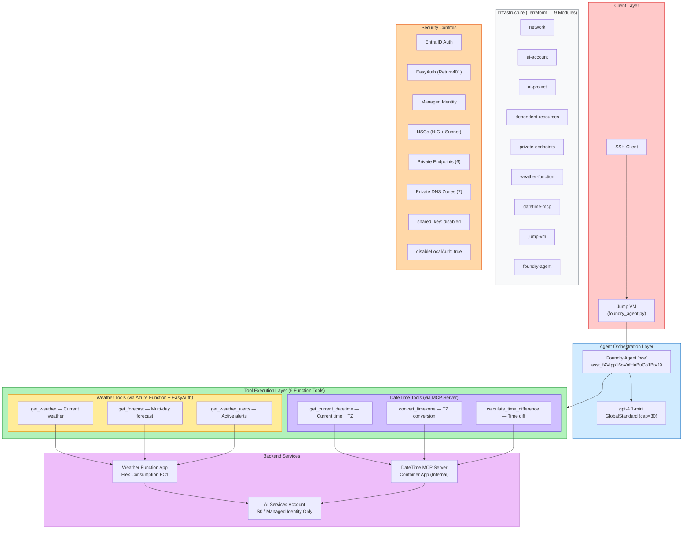
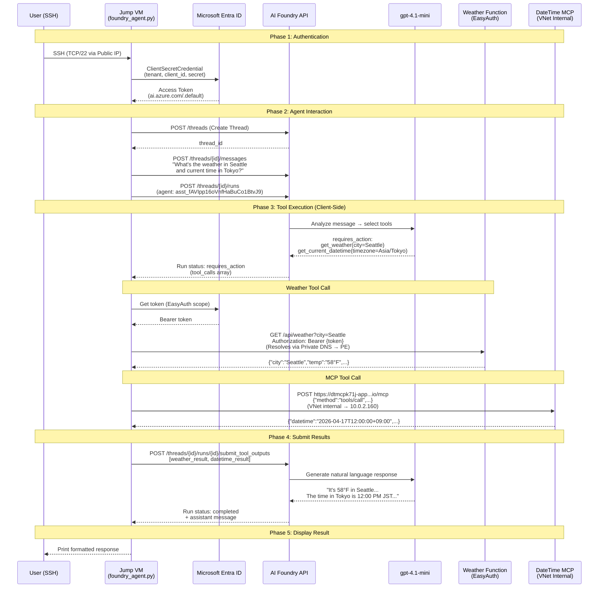

# Hybrid VNet AI Agent — Architecture Diagrams

## 1. High-Level Architecture

```mermaid
graph TB
    subgraph Internet["Internet / Public"]
        User["User (SSH Client)"]
        EntraID["Microsoft Entra ID<br/>Token Issuance"]
        FoundryAPI["AI Foundry Agent API<br/>aiservicesk71j.services.ai.azure.com"]
        WeatherFQDN["Weather Function FQDN<br/>weatherk71j-func.azurewebsites.net"]
    end

    subgraph VNet["agent-vnet (10.0.0.0/16)"]
        subgraph AgentSubnet["agent-subnet (10.0.0.0/24)"]
            DataProxy["AI Services<br/>Network Injection<br/>(Data Proxy)"]
        end

        subgraph PESubnet["pe-subnet (10.0.1.0/24)"]
            PE_AI["PE: AI Services"]
            PE_Blob["PE: Blob Storage"]
            PE_Cosmos["PE: Cosmos DB"]
            PE_Func["PE: Weather Function"]
            PE_Queue["PE: Queue Storage"]
            PE_File["PE: File Storage"]
        end

        subgraph MCPSubnet["mcp-subnet (10.0.2.0/24)"]
            CAE["Container Apps Environment<br/>Internal LB: 10.0.2.160"]
            MCPServer["DateTime MCP Server<br/>dtmcpk71j-app<br/>Streamable HTTP"]
        end

        subgraph FuncSubnet["func-integration-subnet (10.0.3.0/24)"]
            FuncVNet["Weather Function<br/>VNet Integration<br/>(Outbound)"]
        end

        subgraph JumpSubnet["jumpbox-subnet (10.0.4.0/24)"]
            JumpVM["jumpbox-vm<br/>Ubuntu 24.04 LTS<br/>10.0.4.4<br/>foundry_agent.py"]
        end
    end

    subgraph Services["Azure PaaS Services"]
        AISvc["AI Services Account<br/>aiservicesk71j (S0)<br/>gpt-4.1-mini"]
        WeatherFunc["Weather Function App<br/>weatherk71j-func<br/>Flex Consumption (FC1)"]
        ACR["ACR: acrdtmcpk71j<br/>MCP Container Images"]
        Storage1["Storage: aiservicesk71jst<br/>Blob (AI data)"]
        Storage2["Storage: weatherk71jstor<br/>Blob + Queue + File"]
        Storage3["Storage: toolqk71jst<br/>Queue (Tool results)"]
        CosmosDB["Cosmos DB<br/>aiservicesk71jcosmosdb<br/>Thread Storage"]
    end

    User -->|"SSH TCP/22"| JumpVM
    JumpVM -->|"HTTPS + Bearer<br/>ai.azure.com scope"| FoundryAPI
    JumpVM -->|"Entra Token"| EntraID
    JumpVM -->|"HTTPS + EasyAuth Bearer"| WeatherFQDN
    JumpVM -->|"POST /mcp<br/>VNet Internal"| MCPServer

    PE_AI -.->|"Private Link"| AISvc
    PE_Blob -.->|"Private Link"| Storage1
    PE_Cosmos -.->|"Private Link"| CosmosDB
    PE_Func -.->|"Private Link"| WeatherFunc
    PE_Queue -.->|"Private Link"| Storage3
    PE_File -.->|"Private Link"| Storage2

    ACR -.->|"Image Pull"| CAE
    WeatherFunc -.->|"VNet Integration"| FuncVNet
    DataProxy -.->|"Network Injection"| AISvc

    style VNet fill:#d0ebff,stroke:#1971c2,stroke-width:3px
    style AgentSubnet fill:#d0bfff,stroke:#6741d9
    style PESubnet fill:#eebefa,stroke:#9c36b5
    style MCPSubnet fill:#b2f2bb,stroke:#2f9e44
    style FuncSubnet fill:#ffec99,stroke:#f08c00
    style JumpSubnet fill:#ffd8a8,stroke:#e8590c
    style Internet fill:#ffc9c9,stroke:#e03131
    style Services fill:#b2f2bb,stroke:#2f9e44
```

## 2. Component Diagram

## 3. Data Flow — End-to-End Request

## 4. Detailed Network Architecture

```mermaid
graph TB
    subgraph VNet["agent-vnet — 10.0.0.0/16 — eastus2"]
        subgraph S1["agent-subnet<br/>10.0.0.0/24<br/>Delegation: Microsoft.App/environments<br/>NSG: agent-vnet-agent-subnet-nsg-eastus2"]
            DataProxy["AI Services Data Proxy<br/>(Network Injection into VNet)"]
        end

        subgraph S2["pe-subnet<br/>10.0.1.0/24<br/>NSG: agent-vnet-pe-subnet-nsg-eastus2"]
            PE1["PE: aiservicesk71j<br/>→ cognitiveservices"]
            PE2["PE: aiservicesk71jst<br/>→ blob"]
            PE3["PE: aiservicesk71jcosmosdb<br/>→ documents"]
            PE4["PE: weatherk71j-func<br/>→ sites"]
            PE5["PE: toolqk71jst<br/>→ queue"]
            PE6["PE: weatherk71jstor<br/>→ file"]
        end

        subgraph S3["mcp-subnet<br/>10.0.2.0/24<br/>Delegation: Microsoft.App/environments<br/>NSG: agent-vnet-mcp-subnet-nsg-eastus2"]
            CAE["Container Apps Environment<br/>Internal Load Balancer<br/>Static IP: 10.0.2.160"]
            MCP["dtmcpk71j-app<br/>HTTPS:443 → 8080<br/>Streamable HTTP MCP"]
        end

        subgraph S4["func-integration-subnet<br/>10.0.3.0/24<br/>Delegation: Microsoft.Web/serverFarms<br/>NSG: agent-vnet-func-integration-subnet-nsg-eastus2"]
            FuncInt["Weather Function<br/>VNet Integration<br/>(Outbound traffic only)"]
        end

        subgraph S5["jumpbox-subnet<br/>10.0.4.0/24<br/>NSG (NIC): jumpbox-vm-nsg<br/>NSG (Subnet): agent-vnet-jumpbox-subnet-nsg-eastus2<br/>Both have: AllowSSH TCP/22 Priority 100"]
            JVM["jumpbox-vm<br/>Standard_B1s / Ubuntu 24.04<br/>Private: 10.0.4.4<br/>Public: 172.176.124.151"]
        end
    end

    subgraph DNS["Private DNS Zones (All linked to agent-vnet)"]
        D1["privatelink.cognitiveservices.azure.com<br/>→ AI Services PE"]
        D2["privatelink.blob.core.windows.net<br/>→ Storage Blob PEs (×2)"]
        D3["privatelink.documents.azure.com<br/>→ Cosmos DB PE"]
        D4["privatelink.azurewebsites.net<br/>→ Weather Function PE"]
        D5["privatelink.queue.core.windows.net<br/>→ Queue Storage PEs (×2)"]
        D6["privatelink.file.core.windows.net<br/>→ File Storage PE"]
        D7["niceriver-877b9fd9.eastus2.azurecontainerapps.io<br/>A: * → 10.0.2.160<br/>A: @ → 10.0.2.160"]
    end

    PE1 -.-> D1
    PE2 -.-> D2
    PE3 -.-> D3
    PE4 -.-> D4
    PE5 -.-> D5
    PE6 -.-> D6
    CAE -.-> D7

    style VNet fill:#d0ebff,stroke:#1971c2,stroke-width:3px
    style S1 fill:#d0bfff,stroke:#6741d9
    style S2 fill:#eebefa,stroke:#9c36b5
    style S3 fill:#b2f2bb,stroke:#2f9e44
    style S4 fill:#ffec99,stroke:#f08c00
    style S5 fill:#ffd8a8,stroke:#e8590c
    style DNS fill:#d0bfff,stroke:#6741d9
```

---

**Project Details:**
- **Region:** eastus2
- **Subscription:** ME-MngEnvMCAP687688-surep-1
- **Resource Group:** rg-hybrid-agent
- **Agent:** pce (`asst_fAVIpp16oVnfHaBuCo1BtvJ9`) — 6 function tools
- **Model:** gpt-4.1-mini (GlobalStandard, capacity 30)
- **Tool Type:** `function` (client-executed — not compatible with Agent Playground)
- **Security:** Managed identity, EasyAuth, Private Endpoints, no shared keys, no local auth
